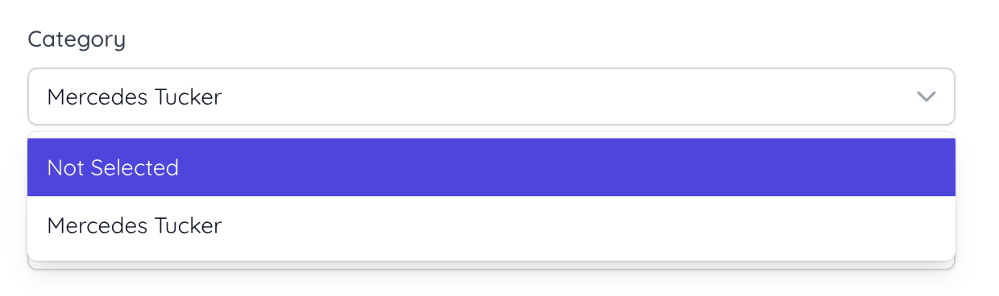

Select Simple component usage example:

<p float="left">
  
</p>

`Create.vue`

```html
<script setup>

import {useForm} from "@inertiajs/vue3";

defineProps({
    categories: Object,
})

const form = useForm({
    post_category_id: {
        id: "0",
        value: "Not Selected",
    },
});
<script>

<template>
    <div>
        <InputLabel for="post_category_id" value="Category"/>

        <SelectSimple
            id="post_category_id"
            v-model="form.post_category_id"
            :items="categories"
            class="mt-1 block w-full"
        />

        <InputError :message="form.errors.post_category_id" class="mt-2"/>
    </div>
</template>
```

`Edit.vue`

```html
<script setup>
import {useForm} from "@inertiajs/vue3";

const props = defineProps({
    post: {
        type: Object,
    },
    categories: Object,
});
const form = useForm({
    post_category_id: props.post.post_category_id,
})
<script>

```

`PostController.php`

```php
private function getCategories(): array
{
    return PostCategory::query()
        ->get()
        ->map(fn ($user) => [
            'id' => $user->id,
            'value' => $user->name,
        ])
        ->prepend([
            'id' => '0',
            'value' => 'Not Selected',
        ])
        ->sortKeys()
        ->toArray();
}

public function create(): Response
{
    $categories = $this->getCategories();

    return Inertia::render('Post/Create', [
        'categories' => $categories,
    ]);
}

public function store(Request $request): RedirectResponse
{
    $request->merge([
        'post_category_id' => $request->post_category_id['id'] ?? null,
    ]);
    $data = $request->validate([
        'post_category_id' => 'required|exists:post_categories,id',
    ], [], [
        'post_category_id' => 'Category',
    ]);
    $model = Post::query()->create($data);

    Session::flash('message', [
        'message' => "Create post {$model->id} success.",
        'type' => 'success',
    ]);

    return redirect()->route('posts.show', $model->id);
}

public function edit(Post $post): Response
{
    $categories = $this->getCategories();

    return Inertia::render('Post/Edit', [
        'categories' => $categories,
        'post' => [
            'id' => $post->id,
            'post_category_id' => [
                'id' => $post->category->id,
                'value' => $post->category->name,
            ],
        ],
    ]);
}
```